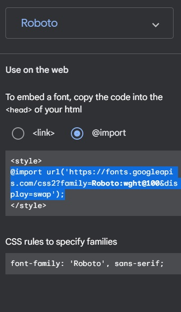
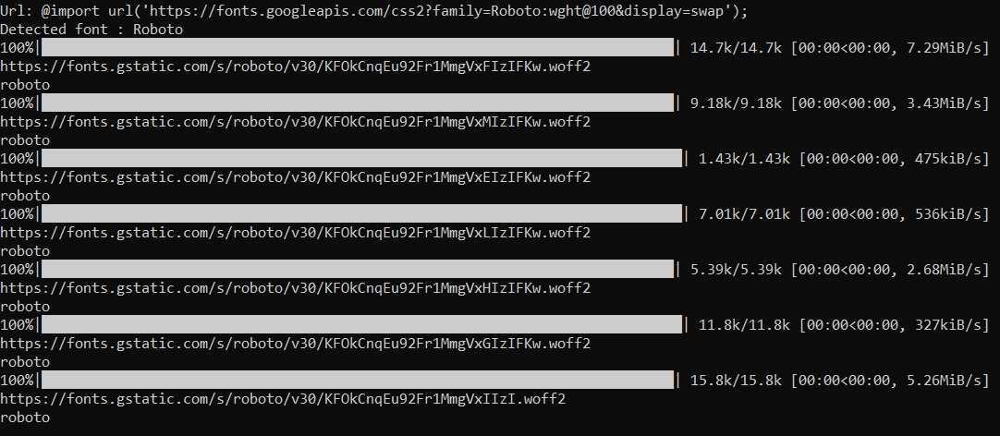
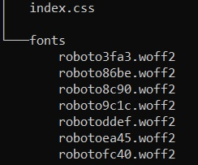

# google_fonts_exporter
A little program that i created to export google fonts to pure files to not have to get it from the actual fonts site it may now work because now is just a test

# How to use it
Select your font (*I used Roboto in the example* he can support multiple fonts selected at the same time)

Select the part where is the link and copy it and pass to the program like this: 

and the final output on the folder where it executed would be 

